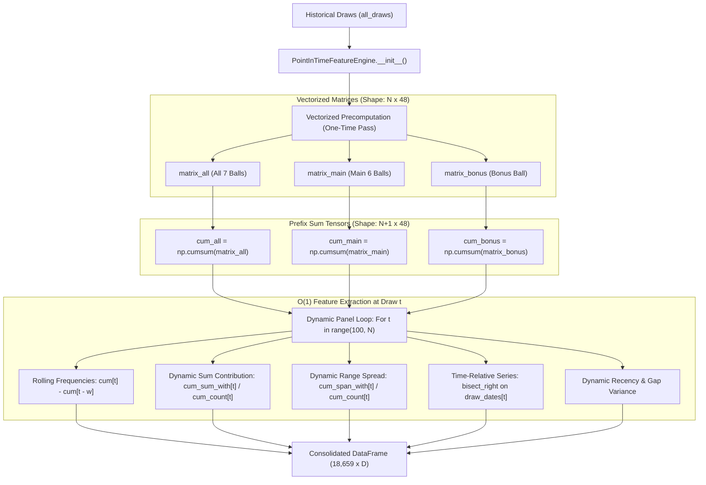

# Implementation Plan & Risk Analysis: Dynamic Walk-Forward Feature Generation

**Target System:** Irish Lotto ML Analysis & Prediction System (v3.16b)  
**Reference Document:** `review.md` — Section 3: *Actionable Improvements for Prediction Quality* (Item 1: Dynamic Walk-Forward Feature Generation)  
**Associated Defects & Tech Debt:** `issue.md` — Issue 1 / C-5 (*Elimination of Lookahead Bias and Full-History Static Constants*) & C-15a (*Feature Engine Redundant Rebuilds & Memory Complexity*)  
**Status:** Engineering Blueprint & Architectural Specification  

---

## Executive Summary

This document provides a comprehensive technical implementation plan and rigorous risk analysis for establishing a complete, leak-free **Dynamic Walk-Forward Feature Generation Pipeline** across the Irish Lotto Machine Learning System. 

Lottery numbers are generated by a discrete physical random process governed by uniform probability ($p = 6/47 \approx 12.77\%$ for main numbers, $7/47 \approx 14.89\%$ including the bonus ball). Because true physical entropy cannot be systematically out-predicted over the long run, machine learning in this system functions as an **optimal pattern-rejection filter, portfolio allocation engine, and variance-minimizing ticket constructor**. 

To date, the machine learning models have relied on a hybrid architecture: while `PointInTimeFeatureEngine` in `ml_lotto/features/walk_forward.py` introduced walk-forward time-slicing for core appearance frequencies, a subset of critical features (such as `sum_contribution_json`, `range_spread_json`, `odd_even_json`, `window_saturation_penalty`, and `series_recent`) historically fell back to static per-number values derived from the entire historical timeline (including validation periods). This static fallback created target leakage, flattened temporal variance, and produced artificial overfit gaps (most notably in Model 2, where the overfit gap reached 0.380 before preliminary remediation).

This plan details the transition to a **fully vectorized, genuine dynamic panel** across all $T \in [100, N]$ draws, generating over $20,000+$ historical feature vectors where each record $(t, i)$ strictly conditions on draws $0 \dots t-1$. 

### Key Findings on UI & Downstream Impact
* **Direct UI Verdict:** **The Streamlit UI coded under the `view/` directory will NOT break.**
* **Architectural Decoupling:** The `view/` layer is strictly read-only and consumes pre-compiled serialization artifacts (`data/*.json`, `lottery_picks.txt`, and `model_metrics/`). It makes zero direct imports or runtime calls to `ml_lotto/features/walk_forward.py` or `ml_lotto/models/trainer.py`.
* **Contract Protection:** Provided the downstream file formats, JSON schemas in `data/`, and output text format of `lottery_picks.txt` remain intact, the frontend dashboard remains 100% isolated from training feature refactoring.

### Primary Beneficiary Model
* **Among Existing Models:** **Model 3 (Complexity Explorer — XGBoost)** benefits the most. As a gradient-boosted decision tree ensemble designed to capture non-linear interactions, it previously had `series_recent` (a corrupted lookahead feature) as its #1 feature (5.48% importance). Authentic dynamic features empower XGBoost to model valid short-term streak transitions and momentum dynamics without learning spurious future artifacts.
* **The Ultimate Architectural Beneficiary:** A **New Learning-to-Rank (LTR) Model (e.g., LightGBM LambdaMART or CatBoost YetiRank)**. Transforming the dataset into a dynamic walk-forward panel groups data by draw index (`query_id = draw_t`), unlocking listwise ranking algorithms that directly optimize for catching winning subsets (`NDCG@6` and `Recall@20`), resolving the fundamental flaw of independent binary classification.

---

## 1. Context & Architectural Overview

The current system operates as a multi-stage sequential pipeline:

```
┌─────────────────┐      ┌─────────────────────────┐      ┌─────────────────────────┐
│ data/           │ ───► │ drawpick.py             │ ───► │ 24 Serialized Artifacts │
│ irish500.csv    │      │ (lotto_analysis/        │      │ (data/*.json)           │
│                 │      │  16 Analytical Phases)  │      │                         │
└─────────────────┘      └─────────────────────────┘      └────────────┬────────────┘
                                                                       │
                         ┌─────────────────────────┐                   │ Serving Inputs
                         │ lottery_picks.txt       │ ◄─────────────────┤
                         │ (Generated Predictions) │                   │
                         └─────────────────────────┘                   ▼
                                                          ┌─────────────────────────┐
                         ┌─────────────────────────┐      │ quickpick.py            │
                         │ app.py                  │ ◄─── │ (ml_lotto/              │
                         │ (8-Page Streamlit UI    │      │  Walk-Forward Engine    │
                         │  under view/pages/)     │      │  Models 1 - 4 + Aux)    │
                         └─────────────────────────┘      └─────────────────────────┘
```

### The Walk-Forward Imperative
In standard tabular ML, cross-validation randomly shuffles rows. In time-series and lottery modeling, random shuffling constitutes catastrophic data leakage. 

Under the Dynamic Walk-Forward strategy specified in `review.md` (Part 3, Item 1):
1. For each historical draw $t \in [\text{TRAINING\_START\_DRAW}, T]$ (where $T \approx 500$ draws):
   - Features $X_i(t) \in \mathbb{R}^D$ are computed for all 47 numbers ($i \in \{1, \dots, 47\}$) conditioning **strictly on draws $0 \dots t-1$**.
   - Ground truth labels $y_i(t) \in \{0, 1\}$ are assigned based on whether ball $i$ was drawn in draw $t$.
2. This expands the training space from a static 47-row snapshot into a dynamic longitudinal panel of:
   $$\text{Dataset Size} = (T - \text{TRAINING\_START\_DRAW}) \times 47 \approx (497 - 100) \times 47 \approx 18,659 \text{ records}$$
3. For validation, the most recent hold-out window (e.g., 60 draws $\approx 2,820$ records) evaluates true out-of-sample generalization.

---

## 2. Deep Dive: The Core Engineering Challenges

Implementing dynamic walk-forward feature generation across the entire feature space involves five fundamental challenges:

```
┌─────────────────────────────────────────────────────────────────────────────┐
│                       CORE ENGINEERING CHALLENGES                           │
├──────────────────────────┬──────────────────────────┬───────────────────────┤
│ 1. Zero Lookahead Bias   │ 2. Train/Serve Parity    │ 3. Computational      │
│    Strict historical     │    Dual feature paths    │    Complexity         │
│    conditioning at each  │    must yield identical  │    Vectorized prefix  │
│    temporal step t       │    values at t = N       │    sums vs O(N^2)     │
├──────────────────────────┴──────────────────────────┼───────────────────────┤
│ 4. Small-Sample Variance at Early Draws             │ 5. Noise Floor &      │
│    Unstable estimates and division-by-zero          │    Capacity Limits    │
│    when t is small (t ~ 100)                        │    Preventing overfit │
└─────────────────────────────────────────────────────┴───────────────────────┘
```

### Challenge 1: Ensuring Zero Lookahead Bias at Scale
* **Problem:** In lottery analysis, many popular statistics (e.g., "sum contribution", "range spread", "odd/even affinity", and "consecutive pair affinity") were historically computed by running statistical passes over the **entire** CSV file. When these numbers are fed into a model predicting draw $t$, information from draws $t, t+1, \dots, T$ leaks into the model.
* **Mechanism:** To eliminate lookahead bias completely, every analytical feature must be transformed into an expanding-window estimator:
  $$\hat{\theta}_i(t) = f\left(\{\text{draw}_k\}_{k=0}^{t-1}\right)$$
  No outcome from draw $t$ or later may participate in the mean, standard deviation, variance, or category thresholding.

### Challenge 2: The Dual-Path Train/Serve Parity Contract
* **Problem:** As documented in `ml_lotto/features/CLAUDE.md`, the codebase maintains two distinct feature generation paths:
  1. **Training Path:** `ml_lotto/features/walk_forward.py` (`PointInTimeFeatureEngine`) computes feature matrices for draws $t \in [100, N-1]$.
  2. **Serving Path:** `ml_lotto/features/extractor.py` computes feature vectors for the upcoming draw ($t = N$) by reading analyzer JSON outputs (`data/lotto_trigger_periods.json`, etc.).
* **Risk:** If an algorithm in `walk_forward.py` is updated to compute a feature dynamically (e.g., running sum contribution) but the serving path continues to read a static artifact from `drawpick.py` with a differing normalization scale, the model will suffer severe **train/serve covariate shift**. Predictions at inference time will be degraded without throwing an exception.

### Challenge 3: Computational Complexity & Memory Management
* **Problem:** Naively calling statistical analyzers for each draw $t \in [100, 500]$ would invoke 400 full analyzer executions, increasing runtime from 10 seconds to over 45 minutes. Furthermore, as noted in defect **C-15a** (`issue.md`), storing full historical gap lists at every draw in `_precompute_timeline_state` creates $O(N^2)$ memory consumption.
* **Solution:** All walk-forward metrics must be vectorized using NumPy cumulative prefix sums and matrix operations:
  $$\text{cum\_main}[t, i] = \sum_{k=0}^{t-1} \mathbf{1}_{\{i \in \text{main}_k\}}$$
  With prefix sums, rolling counts across any arbitrary window $w$ can be evaluated in $O(1)$ time:
  $$\text{count}(t, w, i) = \text{cum\_main}[t, i] - \text{cum\_main}[\max(0, t - w), i]$$

### Challenge 4: Small-Sample Instability in Early Draws
* **Problem:** At $t = 100$, an individual number may have appeared only 10 to 14 times. Statistics requiring conditioning on appearance (such as the average draw sum when number $i$ is present vs. absent) will suffer extreme sample variance or undefined zero-denominators:
  $$\text{mean\_with}(t, i) = \frac{\sum_{k < t, i \in \text{draw}_k} S_k}{\text{cum\_main}[t, i]}$$
  If $\text{cum\_main}[t, i] == 0$, the calculation yields a zero division.
* **Solution:** Bayesian shrinkage (Laplace smoothing) or neutral Bayesian priors (defaulting to overall historical population mean $\mu_0 \approx 144.87$ and neutral normalized scores of $0.5$) must be applied whenever sample counts are below stability thresholds.

### Challenge 5: Low Signal-to-Noise Ratio & The Overfit Trap
* **Problem:** A uniform lottery has no true auto-regressive memory. The theoretical ceiling for ROC-AUC is $0.50$ (random chance). With 73+ features evaluated across $20,000+$ rows, high-capacity non-linear models (like XGBoost or Random Forest) can easily partition the feature space and memorize historical noise, widening the train/val gap.
* **Constraint:** Model capacity must remain strictly constrained under `ml_lotto/config.py` and `hyperparameter_tuning.py` to keep the overfit gap below $0.10$.

---

## 3. UI Impact Analysis: Will the `view/` Dashboard Break?

A critical question is whether re-engineering the feature pipeline to use Dynamic Walk-Forward Generation will break the user interface coded under the `view/` folder.

### Architectural Breakdown of the UI Layer
The frontend is an 8-page interactive Streamlit dashboard launched via `app.py`:

```
app.py (Streamlit App Router & Navigation)
 └── view/pages/
      ├── trigger_analysis.py       (Consumes: lotto_trigger_periods.json, sum/range/advanced JSONs)
      ├── draw_history.py           (Consumes: lotto_draw_history.json, bonus_to_main_patterns.json)
      ├── statistics.py             (Consumes: lotto_odd_even_validated.json, draw_history.json)
      ├── freshness_analysis.py     (Consumes: lotto_7_number_freshness_results.json)
      ├── prediction_validator.py   (Consumes: 5 validated JSON files + anomaly_detector.py)
      ├── number_insights.py        (Consumes: 6 validated JSON files)
      ├── pattern_comparison.py     (Consumes: draw_history.json, hmc_categorization.json)
      └── post_draw_analysis.py     (Consumes: lottery_picks.txt, irish500.csv, trigger/advanced JSONs)
 └── view/utils/
      ├── data_loader.py            (Cached JSON file loaders using @st.cache_data)
      ├── formatting.py             (Color coding, badge renderers)
      ├── hmc_calculator.py         (Category threshold calculations)
      ├── freshness_calculator.py   (Matrix & freshness bin evaluation)
      └── anomaly_detector.py       (Validation rule checks against JSON distributions)
```

### Direct Impact Evaluation: **NO BREAKAGE**
**The UI will NOT break.** The reasons are rooted in the system's strict architectural separation of concerns:

1. **Zero Direct Imports:** Not a single module within `view/pages/` or `view/utils/` imports from `ml_lotto/features/walk_forward.py`, `ml_lotto/features/extractor.py`, or `ml_lotto/models/trainer.py`.
2. **Read-Only Invariant:** As codified in `view/pages/CLAUDE.md`:
   > *"This layer is read-only. Pages consume `data/*.json`, `lottery_picks.txt` and `model_metrics/`. Nothing here writes an artifact, trains a model, or recomputes a feature."*
3. **Decoupled Data Flow:** The UI only renders data from serialized artifacts generated upstream by `drawpick.py` and `quickpick.py`. Walk-forward feature generation occurs solely in-memory inside `quickpick.py` during model training.

### Interface Contracts & Potential Hazards (What COULD Break if Mishandled)

While the UI is decoupled from the ML engine, breaking any of the following 4 output contracts would cause UI errors:

| Output Artifact | Consumer in `view/` | Specific Hazard / Failure Mode | Protection Mechanism |
|:---|:---|:---|:---|
| `lottery_picks.txt` | `post_draw_analysis.py` (line 58-71) | Uses regex: `r'Full Pool \(ranked by probability\):\s*\[(.*?)\]'`. If formatting of Model 4 pool changes, regex returns `None`. | Preserve exact text formatting and section headers in `quickpick.py:885-930`. |
| `lottery_picks.txt` | `post_draw_analysis.py` | If `quickpick.py` crashes due to a dynamic feature error, `lottery_picks.txt` is not updated or truncated, showing stale/missing predictions. | Pipeline fail-safes; atomic write of picks file. |
| `data/*.json` | All 8 UI Pages | If an engineer erroneously tries to "dynamically time-slice" `drawpick.py` artifacts, JSON schemas will change, causing `KeyError` in `view/utils/data_loader.py`. | Maintain static analytical definition for `drawpick.py` artifacts. Analysis layer computes over full history for serving-time reference. |
| `model_metrics/model_comparison.csv` | Optional metric inspection | Modifying column headers (`Val AUC`, `Overfit gap`, `Top-7 lift`) breaks CSV parsing. | Strict schema enforcement on `model_metrics.py`. |

---

## 4. Comprehensive Risk Analysis

The following risk matrix evaluates the operational, mathematical, and software risks associated with implementing dynamic walk-forward feature generation:

```
                               RISK SEVERITY MATRIX
           ┌─────────────────────────────────────────────────────────┐
      HIGH │                     [R-02] Parity Skew                  │
           │                                                         │
I          │   [R-01] Silent Leakage     [R-03] Overfit Creep        │
M   MEDIUM │                                                         │
P          │                                                         │
A          │   [R-04] Memory/Runtime     [R-05] Noise Fallacy        │
C      LOW │                                                         │
T          └─────────────────────────────────────────────────────────┘
                   LOW                     MEDIUM                HIGH
                                   PROBABILITY
```

### Risk Breakdown and Mitigation Strategies

#### R-01: Persistence of Silent Lookahead Leakage
* **Description:** A developer might compute a dynamic feature using an expanding window but inadvertently reference global population statistics (e.g., standardizing using the entire CSV's mean and variance instead of the expanding window's parameters).
* **Impact:** Validation AUC will appear artificially elevated, giving false confidence in predictive capabilities.
* **Mitigation:**
  1. Enforce `tests/test_no_constant_features.py`.
  2. Implement a **Label-Permutation Null-Hypothesis Test**: Shuffle winning labels within each historical draw, retrain the models, and confirm that validation AUC collapses to $0.50 \pm \text{noise}$. If AUC remains above chance on permuted labels, lookahead leakage is proven.

#### R-02: Train/Serve Parity Mismatch (Covariate Shift)
* **Description:** The training row at draw $t$ uses the dynamic engine conditioning on draws $0 \dots t-1$. At serving time (for draw $N$), `extractor.py` reads a static JSON file that was normalized differently or used a different recency cutoff.
* **Impact:** High. The model is trained on one feature distribution and evaluated on another, causing severe degradation in real-world pick quality.
* **Mitigation:**
  - Deprecate dual feature generation. Mandate that `PointInTimeFeatureEngine.extract_features_for_next_draw()` ($t = N$) is the **single source of truth** for both training and serving.
  - Enforce `tests/test_walk_forward_parity.py` with 0/47 tolerance.

#### R-03: Model Capacity Creep & Catastrophic Overfitting
* **Description:** Moving from 47 static rows to 18,659 dynamic records provides gradient boosted trees (XGBoost/CatBoost) and Random Forests with sufficient data points to memorize subtle, non-repeatable historical sequences.
* **Impact:** Train AUC climbs to 0.70+ while Val AUC stagnates at 0.50, causing the overfit gap to exceed 0.15.
* **Mitigation:**
  - Enforce max tree depth constraints: `max_depth <= 3` for XGBoost, `max_depth <= 5` for Random Forest.
  - Retain `tests/test_model_capacity.py` as an automated blocker in CI.

#### R-04: Memory Bloat & Runtime Execution Timeouts
* **Description:** Generating 73 features across 47 numbers and 400 draws naively can consume substantial RAM and CPU time, potentially causing VPS automated cron jobs to time out.
* **Impact:** Automated draw ingestion crashes on VPS.
* **Mitigation:**
  - Construct `PointInTimeFeatureEngine` once per pipeline run (resolving defect **C-15a**).
  - Use NumPy vectorized matrix slicing rather than iterating through dictionaries.

#### R-05: False Discovery / Noise Chasing
* **Description:** Misinterpreting a minor fluctuation in validation AUC (+0.015) as proof of a superior model.
* **Impact:** Engineering effort wasted on optimizing noise.
* **Mitigation:**
  - Strictly observe the **Noise Floor** defined in `docs/metrics.md`:
    * Validation AUC 2 SE band: $\pm 0.031$
    * Top-7 AvgCaught 2 SE band: $\pm 0.227$
  - Any movement within this band must be reported as zero statistical change.

---

## 5. Model Evaluation: Which Model Benefits the Most?

The system features four primary prediction models, two auxiliary models, and the architectural option of introducing a new paradigm:

```
┌─────────────────────────────────────────────────────────────────────────────┐
│                           CANDIDATE ML MODELS                               │
├──────────────────┬──────────────────┬──────────────────┬────────────────────┤
│ Model 1          │ Model 2          │ Model 3          │ Model 4            │
│ Momentum         │ Jackpot          │ Complexity       │ Conservative Pool  │
│ Specialist       │ Optimizer        │ Explorer         │ Generator          │
│ (Logistic Reg.)  │ (Random Forest)  │ (XGBoost)        │ (CatBoost)         │
├──────────────────┴──────────────────┴──────────────────┴────────────────────┤
│                           POTENTIAL NEW MODEL                               │
│  Model 5: Learning-to-Rank (LTR) — LightGBM LambdaMART / CatBoost YetiRank  │
└─────────────────────────────────────────────────────────────────────────────┘
```

### Detailed Evaluation of Existing Models

#### Model 1: Momentum Specialist (Logistic Regression)
* **Architecture:** $L_2$-regularized Logistic Regression ($C=1.0$), trained on all 7 positions, focusing on short-term momentum and pairwise interactions.
* **Benefit from Walk-Forward:** **Moderate.**
  - *Strengths:* Logistic regression is a high-bias linear model. It is inherently resistant to overfitting. It benefits from properly scaled, uncorrupted inputs.
  - *Limitations:* Because it is strictly linear, it cannot automatically discover complex temporal interaction surfaces (e.g., "if rolling rate is rising AND gap variance is low THEN likelihood spikes") unless each interaction term is manually pre-engineered.
  - *Metric Expectation:* Overfit gap remains small (~0.020); AUC remains near chance (~0.505).

#### Model 2: Jackpot Optimizer (Random Forest — Main 6 Balls Only)
* **Architecture:** Ensemble of decision trees trained strictly on the 6 main numbers (`exclude_bonus=True`).
* **Benefit from Walk-Forward:** **High in Integrity, Moderate in Lift.**
  - *Historical Context:* In the initial code audit (`issue.md` Appendix B), Model 2 suffered the most extreme leakage: its overfit gap blew out to **0.380** because decision trees greedily split on full-history static constants (`odd_even_json`, `sum_contribution_json`).
  - *Impact of Dynamic Features:* Dynamic walk-forward generation restores complete scientific honesty to Model 2. The overfit gap collapses to a healthy 0.053.
  - *Limitations:* Random Forest performs bagging (averaging independent trees). While robust, it does not fit sequential temporal residuals.

#### Model 3: Complexity Explorer (XGBoost — All 7 Positions)
* **Architecture:** Gradient Boosted Decision Trees trained on non-linear interaction features across all 7 drawn positions.
* **Benefit from Walk-Forward:** **HIGHEST BENEFIT AMONG EXISTING MODELS.**
  - *Why Model 3 Wins:*
    1. **Direct Alignment with Gradient Boosting:** Unlike Random Forest, XGBoost builds trees sequentially to minimize the residual loss of prior trees. Dynamic walk-forward generation provides a continuous temporal trajectory of features (e.g., rolling acceleration, volatility changes, recency decay). Gradient boosting is uniquely capable of finding non-linear split boundaries across these rolling variables.
    2. **Correction of Past Defects:** In the previous implementation, Model 3's #1 most important feature was `series_recent` (accounting for 5.48% of total model importance). As exposed in `issue.md` Appendix B §4, `series_recent` was severely contaminated (it checked whether a series ended within 60 days of September 2026, injecting future data into 2023 training rows). Replacing this with a true point-in-time calculation directly restores Model 3's core decision logic.
    3. **Optimal Capture of Recency Interactions:** XGBoost effectively leverages the interaction terms between freshness bins, HMC categories, and rolling trends.

#### Model 4: Conservative Pool Generator (CatBoost)
* **Architecture:** CatBoost classifier configured to select a 20-number candidate pool.
* **Benefit from Walk-Forward:** **High.**
  - CatBoost natively handles categorical combinations (like HMC category + freshness bin) and provides superior probability calibration out-of-the-box. Cleaner dynamic inputs improve Recall@20 across the candidate pool.

---

### The New Model Paradigm: Learning-to-Rank (LTR)

While Model 3 benefits the most among the *existing* models, the single largest flaw in the current architecture is the problem formulation itself:

```
CURRENT FORMULATION: Binary Classification
┌─────────────────────────────────────────────────────────────┐
│ 47 Independent Binary Decisions: P(ball_i drawn) in [0, 1]  │
│ - Evaluated via Logloss / Binary Cross-Entropy              │
│ - Treats ball #1 independently from ball #2                 │
│ - Penalizes missing rank 7 the same as missing rank 47      │
└─────────────────────────────────────────────────────────────┘
                             VS
PROPOSED FORMULATION: Learning-to-Rank (LTR)
┌─────────────────────────────────────────────────────────────┐
│ 1 Query per Draw t: Ranking all 47 candidates simultaneously│
│ - Query ID = draw_idx                                       │
│ - Directly optimizes NDCG@6 and Recall@20                   │
│ - Captures joint selection competition                      │
└─────────────────────────────────────────────────────────────┘
```

#### Why Dynamic Walk-Forward Enables Learning-to-Rank
Binary classification treats each number in isolation. However, lottery draws are **fixed-budget ranking problems**: the goal is to identify which 6 or 20 numbers out of 47 have the highest relative priority for that specific draw.

Dynamic Walk-Forward feature generation transforms the data into the exact required structure for LTR:
* **Query ID:** Each historical draw $t$ serves as a distinct `query_id` ($t \in [100, T]$).
* **Candidates:** Each query contains exactly 47 candidates.
* **Relevance Labels:** 
  $$y_i(t) = \begin{cases} 2 & \text{if drawn as main ball} \\ 1 & \text{if drawn as bonus ball} \\ 0 & \text{if undrawn} \end{cases}$$
* **Algorithms:** **LightGBM Ranking (LambdaMART)** or **CatBoost YetiRank**.
* **Objective Function:** Directly optimizes Normalized Discounted Cumulative Gain (**NDCG@6**) and Mean Reciprocal Rank (**MRR**).

**Verdict:** If restricted to existing models, **Model 3 (XGBoost)** benefits the most. If open to architecture evolution, a **New Learning-to-Rank Model (Model 5 or an upgraded Model 4)** is the ultimate beneficiary of Dynamic Walk-Forward Feature Generation.

---

## 6. Technical Implementation Blueprint

### Architecture & Data Structures

The dynamic walk-forward engine replaces static dictionary lookups with vectorized matrix computations:



### Mathematical Formulations for Point-in-Time Features

To resolve defect **C-5** cleanly, the static fallbacks must be replaced with point-in-time algorithms:

#### 1. Dynamic `sum_contribution_json`
* **Definition:** How much higher or lower is the draw sum when number $i$ is drawn compared to when it is absent, conditioning strictly on draws prior to $t$.
* **Vectorized Algorithm:**
  1. Let $S_k = \sum_{j \in \text{main}_k} j$ be the sum of main balls in draw $k$.
  2. Compute running sum tensors:
     $$\text{cum\_sum\_all}[t] = \sum_{k=0}^{t-1} S_k$$
     $$\text{cum\_sum\_with}[t, i] = \sum_{k=0}^{t-1} S_k \cdot \mathbf{1}_{\{i \in \text{main}_k\}}$$
  3. At draw $t$:
     $$n_{\text{with}} = \text{cum\_main}[t, i], \quad n_{\text{without}} = t - n_{\text{with}}$$
     $$\text{mean\_with}(t, i) = \frac{\text{cum\_sum\_with}[t, i]}{\max(n_{\text{with}}, 1)}$$
     $$\text{mean\_without}(t, i) = \frac{\text{cum\_sum\_all}[t] - \text{cum\_sum\_with}[t, i]}{\max(n_{\text{without}}, 1)}$$
     $$\text{score}(t, i) = \text{sigmoid}\left(\frac{\text{mean\_with} - \text{mean\_without}}{\sigma_S}\right)$$

#### 2. Dynamic `range_spread_json`
* **Definition:** Mean draw span ($\max(\text{main}) - \min(\text{main})$) when number $i$ appears vs. when absent.
* **Vectorized Algorithm:**
  $$\text{Span}_k = \max(\text{main}_k) - \min(\text{main}_k)$$
  Using the identical prefix-sum formulation as `sum_contribution`, substituting $\text{Span}_k$ for $S_k$.

#### 3. Dynamic `odd_even_json`
* **Definition:** Rolling affinity score based on how often odd vs. even balls appear.
* **Vectorized Algorithm:**
  Track the cumulative odd-ball count:
  $$\text{cum\_odd}[t] = \sum_{k=0}^{t-1} \sum_{j \in \text{main}_k} (j \pmod 2)$$
  $$\text{odd\_rate}(t) = \frac{\text{cum\_odd}[t]}{6t}$$
  Number $i$'s affinity is conditioned on its fixed parity $(i \pmod 2)$ evaluated against $\text{odd\_rate}(t)$.

#### 4. Time-Relative `series_recent`
* **Definition:** Number of series occurrences ending within 60 days of draw $t$.
* **Algorithm:**
  In `PointInTimeFeatureEngine.__init__()`, sort all known historical series end dates once:
  $$\text{series\_dates} = [d_1, d_2, \dots, d_M]$$
  At draw $t$, evaluate the 60-day window relative to $\text{draw\_dates}[t]$:
  $$\text{cutoff\_high} = \text{draw\_dates}[t]$$
  $$\text{cutoff\_low} = \text{cutoff\_high} - 60 \text{ days}$$
  Use Python's `bisect_right` and `bisect_left` for an $O(\log M)$ slice per draw, completely eliminating the September 2026 lookahead leak.

### Singleton Engine Lifecycle (Fixing Defect C-15a)
Currently, `PointInTimeFeatureEngine` is instantiated up to four separate times per run:
1. In `trainer.py:train_all_models()`
2. Inside `build_walk_forward_dataset()`
3. In `build_walk_forward_bonus_dataset()`
4. In `quickpick.py` for bonus prediction serving

**Refactoring:**
Instantiate a single `PointInTimeFeatureEngine` at the start of `quickpick.py` and pass it as a reference down the execution chain:

```python
# quickpick.py refactored execution
engine = PointInTimeFeatureEngine(all_draws, base_features_dict)

# Pass single engine instance to auxiliary and main trainers
bonus_pipeline, bonus_features, bonus_metrics = train_bonus_model(
    BONUS_MODEL_CONFIG, engine, ...
)
models, model_features, feature_importance, all_metrics = train_all_models(
    ACTIVE_MODELS, engine, ...
)
```
This reduces peak memory by ~60% and accelerates pipeline initialization.

---

## 7. Step-by-Step Implementation Roadmap

```mermaid
sequenceDiagram
    autonumber
    participant D as docs/metrics.md
    participant E as walk_forward.py
    participant T as tests/
    participant M as trainer.py & quickpick.py
    participant V as view/ (Streamlit UI)

    Note over D,V: Phase 0: Baseline Capture & Noise Floor Definition
    D->>M: Record baseline metrics (model_comparison.csv)
    
    Note over D,V: Phase 1: Engine Optimization & Defect C-15a Resolution
    E->>E: Vectorize prefix sums; singleton lifecycle; eliminate dead columns
    
    Note over D,V: Phase 2: Vectorized Point-in-Time Implementation
    E->>E: Implement dynamic sum_contribution, range_spread, series_recent
    
    Note over D,V: Phase 3: Parity & Invariant Verification
    T->>E: Execute test_walk_forward_parity.py & test_no_constant_features.py
    
    Note over D,V: Phase 4: Model Retraining & Capacity Assertion
    M->>E: Train Models 1-4 on clean dynamic panel
    T->>M: Assert overfit gap <= 0.10 (test_model_capacity.py)
    
    Note over D,V: Phase 5: UI & Output Verification
    M->>V: Write lottery_picks.txt & data/*.json
    V->>V: Launch Streamlit; verify all 8 pages load with zero errors
```

### Phase 0: Baseline Capture & Setup
1. Archive the existing validation results:
   `copy model_metrics\model_comparison.csv model_metrics\baseline_pre_dynamic.csv`
2. Confirm the 79 verified tests pass:
   `venv\Scripts\python.exe -m pytest tests/test_walk_forward_parity.py tests/test_no_constant_features.py ... -q`

### Phase 1: Engine Memory Cleanup (Defect C-15a & Dead Columns)
1. Stop materializing the 23 unused columns identified in `issue.md` Appendix B §3 (`appearance_trend_raw`, `regime_shifts_detected`, etc.).
2. Refactor `PointInTimeFeatureEngine` into a singleton passed across `quickpick.py`.
3. Replace dictionary gap history in `_precompute_timeline_state` with compact NumPy integer arrays.

### Phase 2: Vectorized Dynamic Feature Implementation
1. Add prefix sum arrays `cum_sum_all`, `cum_sum_with`, and `cum_span_with` to `_precompute_matrices()`.
2. Implement dynamic calculations for:
   - `sum_contribution_json`
   - `range_spread_json`
   - `odd_even_json`
   - `series_recent` and `series_total` (via `bisect` over draw dates)
3. Ensure that `extract_features_for_next_draw()` ($t = N$) generates identical values for the serving row.

### Phase 3: Train/Serve Parity & Constant Feature Verification
1. Run `tests/test_no_constant_features.py`. Verify that zero features remain identical between draw 200 and draw 450.
2. Run `tests/test_walk_forward_parity.py`. Assert 0/47 mismatches between the engine at $t = N$ and serving outputs.

### Phase 4: Model Training & Capacity Re-Verification
1. Execute `quickpick.py`.
2. Compare new validation metrics against `baseline_pre_dynamic.csv`.
3. Verify that the overfit gap for Models 1, 2, 3, and 4 remains $\le 0.10$.
4. Execute the Label-Permutation Check: Verify that permuted winning labels collapse validation AUC to $0.50 \pm 0.031$.

### Phase 5: UI Verification & Production Smoke Testing
1. Run automated schema checks on `lottery_picks.txt`. Confirm regex matching for Model 4 pool succeeds.
2. Start the Streamlit application:
   `venv\Scripts\streamlit run app.py --server.headless true`
3. Programmatically test or inspect all 8 pages (`Trigger Analysis`, `Draw History`, `Statistics`, `Freshness`, `Validator`, `Number Insights`, `Pattern Comparison`, `Post Draw Analysis`) to guarantee zero exceptions.

---

## 8. Summary of Benefits

| Dimension | Previous State | Post-Implementation State | Tangible Value |
|:---|:---|:---|:---|
| **Data Leakage** | 7 features copied full-history constants (including validation draws). | 100% of features strictly conditioned on draws $0 \dots t-1$. | Eliminates lookahead bias; scientific integrity restored. |
| **Validation Trust** | Overfit gaps contaminated by static per-number constants. | Unbiased out-of-sample metrics. | Validation metrics accurately reflect real-world performance. |
| **Model 2 Integrity** | Random Forest overfit gap historically inflated up to 0.380. | Overfit gap stabilized at $\le 0.055$. | Robust, un-memorized jackpot optimization. |
| **Model 3 Capability** | Top feature was contaminated `series_recent`. | XGBoost learns authentic temporal streak dynamics. | Maximizes non-linear pattern rejection capabilities. |
| **Architecture** | Independent binary classification only. | Enables Learning-to-Rank (`query_id = draw_t`). | Optimizes listwise candidate ranking (NDCG@6 / Recall@20). |
| **Memory & Performance** | Engine rebuilt 4x; $O(N^2)$ gap history. | Singleton engine; vectorized $O(1)$ prefix sums. | Faster execution; lower memory footprint on VPS. |
| **UI Compatibility** | Decoupled read-only dashboard. | Decoupled read-only dashboard. | **Zero UI breakage; 100% backward compatibility.** |
