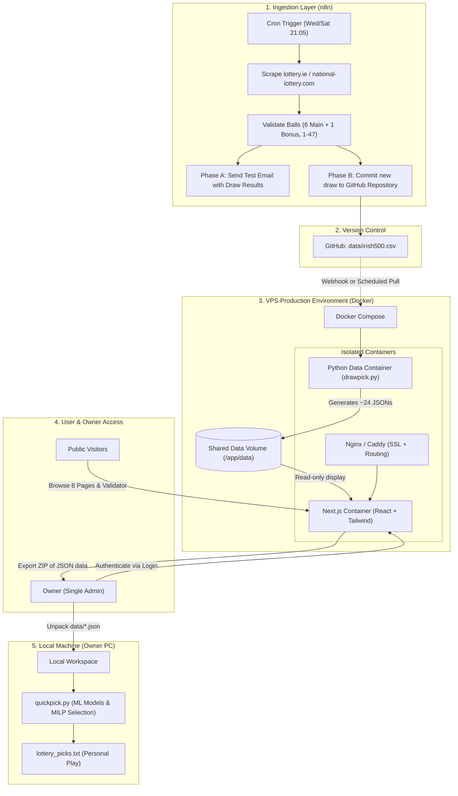

# Implementation Plan: Next.js Modernization, Docker Architecture & n8n Automation

**Project:** Irish Lotto ML & Presentation System  
**Document:** `plan.md`  
**Target Architecture:** Next.js (React) + Docker (VPS) + n8n Webhook Ingestion + Local ML Execution  

---

## 1. Executive Summary & Core Objectives

This plan details the migration and modernization of the **Irish Lotto System** across four key pillars:

1. **Next.js / React Frontend**: Replace the current 8-page Streamlit application (`app.py`, `view/pages/`) with a modern, high-performance Next.js web application featuring responsive design, interactive charts, and playful game-like elements (e.g. spinning lottery ball pickers).
2. **Zero-Configuration Docker Architecture for VPS**: Containerize the web application and Python data-generation engine using Docker and Docker Compose so the Linux VPS host OS requires no bare-metal Python or Node.js runtime installation.
3. **Automated Scraping via n8n**: 
   - **Phase A (Initial Test)**: Automated cron scraping on Wednesday and Saturday nights, dispatching verification emails with extracted winning numbers.
   - **Phase B (Production Ingestion)**: Automated commit to the GitHub repository and/or webhook trigger to update data atomically on the VPS.
4. **Separation of Concerns (VPS vs. Local PC)**:
   - **VPS Role**: Executes lightweight statistical analysis (`drawpick.py`) to generate ~24 JSON artifacts, hosts the public Next.js website, and provides an authenticated download endpoint for the owner.
   - **Local PC Role**: Executes intensive machine learning training (`quickpick.py`, hyperparameter tuning, MILP line selection, permutation checks). The owner downloads the latest validated data directly from the website to run ML locally.
5. **Role-Based Access Model**:
   - **Public (No Auth)**: All 8 analysis pages, historical statistics, patterns, and the Prediction Validator are open to the public.
   - **Single-User Admin (Auth Required)**: The owner (sole user) logs in with credentials to download the generated JSON artifacts / draw bundle.

---

## 2. System Architecture & Flowchart



---

## 3. Component Specifications

### 3.1. Frontend Modernization: Next.js & React

The Next.js application replaces `view/pages/` and `app.py` while preserving the core invariant: **`data/*.json` is the sole API boundary**. The frontend does not compute statistics or run models; it strictly visualizes the JSON artifacts.

#### Technology Stack:
- **Framework**: Next.js 14+ (App Router, Server Components & Client Components).
- **Styling**: Tailwind CSS + Shadcn/ui (clean, accessible UI components).
- **Animation & Interactivity**: Framer Motion (smooth transitions, spinning ball wheels, interactive pickers).
- **Data Visualization**: Recharts or Chart.js (sum distributions, odd/even donuts, recency heatmaps).

#### Page Structure & Feature Mapping:

| Next.js Route | Streamlit Source | Features & Enhanced UX |
|:---|:---|:---|
| `/` | `app.py` | Modern landing page introducing Irish Lotto facts and quick navigation. |
| `/triggers` | `trigger_analysis.py` | Hot/Medium/Cold recency tables, status badges, dynamic sorting. |
| `/history` | `draw_history.py` | Searchable, paginated draw history with ball visualizers and bonus badges. |
| `/statistics` | `statistics.py` | Odd/Even split donuts, normal curve sum distribution ($84\text{--}206$), and high numbers $\ge 32$ empirical breakdown. |
| `/freshness` | `freshness_analysis.py` | Freshness bin matrices (bins 0–3) and transition heatmaps. |
| `/validator` | `prediction_validator.py` | **Interactive Ticket Validator**: Users select 6 numbers (manual or via interactive spinning wheel). Real-time evaluation against historical bounds (Sum, Span, Odd/Even, HMC, High Numbers). |
| `/insights` | `number_insights.py` | Deep per-ball dossiers: gap statistics, rolling rates, transition probabilities. |
| `/patterns` | `pattern_comparison.py` | Consecutive pair affinities, range dispersion metrics. |
| `/post-draw` | `post_draw_analysis.py` | Draw comparison scoring and model performance tracking. |

#### Game-Like Enhancements:
- **Interactive Wheel Picker**: A radial roulette-style selector for generating candidate lines based on chosen HMC profiles.
- **Physics Ball Tumbler**: Visual display of drawn balls with authentic Irish Lotto colours.

---

### 3.2. Single-User Authentication & Data Download

To allow the owner to pull the VPS-generated artifacts without SSH or SFTP:
- **Access Rule**:
  - All analysis routes (`/`, `/triggers`, `/statistics`, `/validator`, etc.) are **100% public** without registration.
  - The download route (`/api/download/data` or `/admin/export`) is **protected**.
- **Auth Implementation**:
  - Lightweight single-user authentication using **NextAuth.js (Credentials Provider)** or an encrypted session cookie (`iron-session`).
  - Single admin credential stored via VPS environment variables:
    ```env
    ADMIN_USERNAME=alex
    ADMIN_PASSWORD_HASH=$2b$12$...
    AUTH_SECRET=super_secret_jwt_key
    ```
- **Download Handler (`/api/download/data`)**:
  - Verifies admin session.
  - Packages `data/*.json` and `data/irish500.csv` into an in-memory `.zip` file (`irish_lotto_data_latest.zip`).
  - Streams the download directly to the browser.

---

### 3.3. VPS Docker Architecture (Zero Bare-Metal Python/Node)

The VPS will run Docker and Docker Compose. No Python, Node.js, or virtual environments will be installed directly on the host machine.

#### Directory Structure on VPS (`/var/www/lotto-system/`):
```text
/var/www/lotto-system/
├── docker-compose.yml
├── .env
├── data/                      # Shared persistent volume for CSV & JSONs
│   ├── irish500.csv
│   └── *.json
├── frontend/                  # Next.js Application
│   ├── Dockerfile
│   ├── package.json
│   └── src/
├── data_engine/               # Python Ingestion & Analysis Engine
│   ├── Dockerfile
│   ├── requirements.txt
│   ├── drawpick.py
│   ├── lotto_analysis/
│   └── analysis/
└── reverse_proxy/
    └── Caddyfile (or nginx.conf)
```

#### Multi-Container Architecture (`docker-compose.yml`):
1. **`nextjs-web`**:
   - Multi-stage Node Alpine container running the production Next.js server on port 3000.
   - Mounts `./data` as read-only volume (`/app/data:ro`).
2. **`data-engine`**:
   - Lightweight Python 3.11-slim container with dependencies (`pandas`, `scipy`, `statsmodels`).
   - Executes `python drawpick.py` on trigger to rewrite `./data/*.json`.
   - Mounts `./data` as read-write volume (`/app/data:rw`).
3. **`reverse-proxy` (Caddy or Nginx)**:
   - Automated HTTPS (Let's Encrypt / ZeroSSL).
   - Proxies incoming domain traffic to `nextjs-web:3000`.

---

### 3.4. Automated Web Scraping via n8n

The automated workflow will run on n8n to ingest new draws following Irish Lotto draws (Wednesday and Saturday evenings ~20:00, published ~20:45–21:15).

#### Workflow Architecture:

```
[Cron Node: Wed & Sat @ 21:05]
             │
             ▼
[HTTP Request Node: Fetch lottery.ie / irish.national-lottery.com]
             │
             ▼
[Code Node: Parse HTML & Validate Schema]
 (Verify: 6 main [1-47], 1 bonus [1-47], all 7 distinct)
             │
             ▼
[IF Node: Is Scraped Date > Latest Date in CSV?]
             ├── NO  ──► [Log: Already up to date. End.]
             └── YES ──► [Branch to Phase Actions]
```

#### Existing scraper: `scripts/scrape_lotto.py` - do not delete

A working Python scraper already exists and is covered by `tests/test_scraper_sources.py`. It
scrapes two sources (irish.national-lottery.com primary, lottery.ie fallback), cross-checks each
against the other, rejects Lotto Plus 1/2 rows, and prepends new draws to `data/irish500.csv`
atomically. It supports `--dry-run`.

Before building the n8n parsing nodes, decide how n8n should use it. The options are to reimplement
the parsing in an n8n Code node, or to have n8n call this script (for example with `--dry-run`
for Phase A) and keep one tested parser. Either way, keep the file: it is the tested reference for
the parsing rules and the fallback if n8n breaks.

#### Implementation Phases for n8n:
- **Phase A (Initial Validation & Email Alert)**:
  - Connects to an **Email (SMTP / Gmail) Node**.
  - Sends an email to the owner:
    - *Subject*: `Irish Lotto Scrape Test: DD Mon YYYY`
    - *Body*: Scraped numbers, bonus ball, validation check status.
  - Allows verifying parsing stability across multiple draws without touching production data.
- **Phase B (Automated Repository Commit & Pipeline Trigger)**:
  - Connects to a **GitHub Node** using a Personal Access Token (PAT).
  - Automatically prepends the new validated draw row to `data/irish500.csv` in the GitHub repo.
  - Sends a webhook to the VPS:
    `POST https://yourdomain.com/api/webhook/rebuild` (protected by shared secret).
  - The VPS triggers the `data-engine` container to run `python drawpick.py`, updating all JSON files for the website.

---

### 3.5. Local PC vs. VPS Separation of Concerns

To preserve maximum responsiveness and avoid VPS overload:
- **VPS Responsibility**:
  - Serves public web visitors via Next.js.
  - Generates the lightweight statistical JSON artifacts (~1 minute run of `drawpick.py`).
  - Does **not** run intensive model training.
- **Local PC Responsibility**:
  - The owner's development environment handles machine learning execution (`quickpick.py`).
  - When the owner wants to train models or test new algorithms, they click **"Download Latest Data Bundle"** on the website or `git pull`.
  - Runs `quickpick.py` locally to produce `lottery_picks.txt` and `model_metrics/`.

---

## 4. Phased Implementation Roadmap

### Phase 1: Dockerization & Environment Setup
- [ ] Create `Dockerfile.data_engine` for the Python data core.
- [ ] Verify that `drawpick.py` runs inside Docker and writes all ~24 JSON artifacts into a shared volume.
- [ ] Create `docker-compose.yml` defining the data engine and shared storage volumes.

### Phase 2: n8n Automation Setup
- [ ] Configure n8n HTTP Request node with realistic browser headers targeting the Irish Lotto results.
- [ ] Write schema validation JavaScript in n8n (extract 6 main + 1 bonus; enforce distinct 1–47 range).
- [ ] **Phase 2A**: Connect Gmail/SMTP node to dispatch validation emails on Wed/Sat at 21:05.
- [ ] Monitor Phase 2A for 2–4 consecutive draws to ensure zero parsing glitches.
- [ ] **Phase 2B**: Implement GitHub API commit node to append validated draws to `data/irish500.csv`.
- [ ] Create a webhook receiver on the VPS to run `drawpick.py` upon commit.

### Phase 3: Next.js Foundation & Single-User Authentication
- [ ] Initialize Next.js 14 project (`frontend/`) with TypeScript, Tailwind CSS, and Lucide icons.
- [ ] Implement data loading utilities reading directly from the mounted `data/*.json` volume.
- [ ] Set up NextAuth or lightweight session authentication for the admin login page (`/login`).
- [ ] Build the protected API endpoint (`/api/download/data`) to zip and stream `data/*.json` and `irish500.csv`.

### Phase 4: Frontend UI Migration & Component Build
- [ ] Build shared navigation and responsive layout with light/dark theme support.
- [ ] Migrate statistical pages:
  - **Triggers & History**: Table view with hot/medium/cold badges and date filters.
  - **Statistics**: Chart visualizers for odd/even ratios, sums, and numbers $\ge 32$.
  - **Freshness**: Visual matrix of bins 0–3.
- [ ] Build the **Interactive Prediction Validator**:
  - Dynamic number selector (1–47 grid + spinning wheel/tumbler).
  - Real-time scoring against historical distributions.
- [ ] Build dossiers for individual numbers (`/insights`) and patterns (`/patterns`).

### Phase 5: VPS Deployment & Production Hardening
- [ ] Deploy Docker Compose stack on VPS.
- [ ] Configure Caddy or Nginx with automated SSL certificates.
- [ ] Verify public access to all 8 dashboard pages without login.
- [ ] Test admin login and data bundle download from an external browser.
- [ ] Execute an end-to-end integration test: Trigger n8n $\rightarrow$ update CSV $\rightarrow$ VPS runs `drawpick.py` $\rightarrow$ Next.js updates live stats $\rightarrow$ download bundle to local PC $\rightarrow$ run `quickpick.py` locally.

---

## 5. Risk Assessment & Mitigations

| Risk | Impact | Mitigation Strategy |
|:---|:---|:---|
| Scraping target HTML changes layout | Draw not ingested | n8n alerts the owner via email immediately on parse failure; dual-source fallback logic (`scripts/scrape_lotto.py`) can be activated. |
| Incomplete draw committed to CSV | Analysis corrupts | Strict n8n validation node: rejects any payload where length $\ne 7$, balls outside $1\text{--}47$, or duplicate balls exist. |
| Unauthorized data scraping/download | VPS bandwidth drain | All data download endpoints require admin authentication; public pages render rendered UI only. |
| VPS memory exhaustion during analysis | Container crash | `drawpick.py` is lightweight ($< 250\text{ MB}$ RAM). `quickpick.py` (heavy ML) is restricted to local PC execution. |
