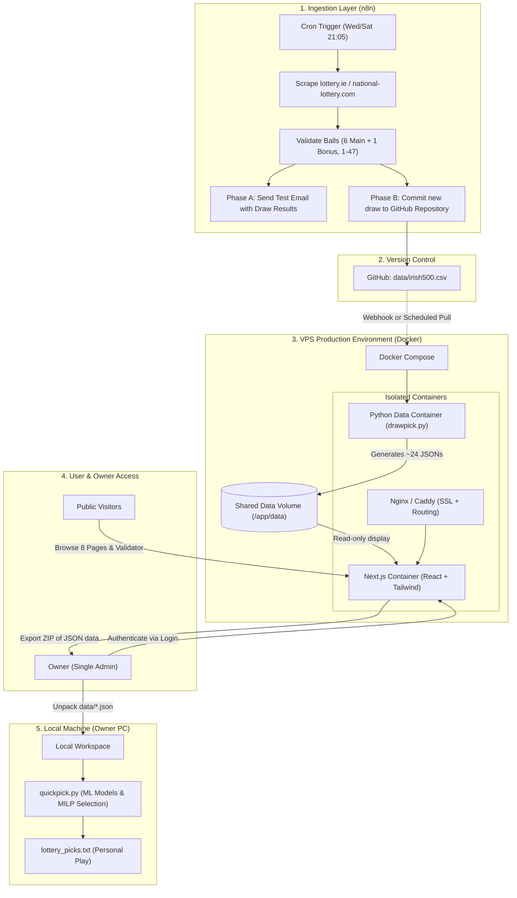

# Implementation Plan: Next.js Modernization, Docker Architecture & n8n Automation

**Project:** Irish Lotto ML & Presentation System  
**Document:** `plan.md`  
**Target Architecture:** Next.js (React) + Docker (VPS) + n8n Webhook Ingestion + Local ML Execution  

---

## 1. Executive Summary & Core Objectives

This plan details the migration and modernization of the **Irish Lotto System** across four key pillars:

1. **Next.js / React Frontend**: Replace the current 8-page Streamlit application (`app.py`, `view/pages/`) with a modern, high-performance Next.js web application featuring responsive design, interactive charts, and playful game-like elements (e.g. spinning lottery ball pickers).
2. **Zero-Configuration Docker Architecture for VPS**: Containerize the web application and Python data-generation engine using Docker and Docker Compose so the Linux VPS host OS requires no bare-metal Python or Node.js runtime installation.
3. **Automated Scraping via n8n**: 
   - **Phase A (Initial Test)**: Automated cron scraping on Wednesday and Saturday nights, dispatching verification emails with extracted winning numbers.
   - **Phase B (Production Ingestion)**: Automated commit to the GitHub repository and/or webhook trigger to update data atomically on the VPS.
4. **Separation of Concerns (VPS vs. Local PC)**:
   - **VPS Role**: Executes lightweight statistical analysis (`drawpick.py`) to generate ~24 JSON artifacts, hosts the public Next.js website, and provides an authenticated download endpoint for the owner.
   - **Local PC Role**: Executes intensive machine learning training (`quickpick.py`, hyperparameter tuning, MILP line selection, permutation checks). The owner downloads the latest validated data directly from the website to run ML locally.
5. **Role-Based Access Model**:
   - **Public (No Auth)**: All 8 analysis pages, historical statistics, patterns, and the Prediction Validator are open to the public.
   - **Single-User Admin (Auth Required)**: The owner (sole user) logs in with credentials to download the generated JSON artifacts / draw bundle.

---

## 2. System Architecture & Flowchart



---

## 3. Component Specifications

### 3.1. Frontend Modernization: Next.js & React

The Next.js application replaces `view/pages/` and `app.py` while preserving the core invariant: **`data/*.json` is the sole API boundary**. The frontend does not compute statistics or run models; it strictly visualizes the JSON artifacts.

#### Technology Stack:
- **Framework**: Next.js 14+ (App Router, Server Components & Client Components).
- **Styling**: Tailwind CSS + Shadcn/ui (clean, accessible UI components).
- **Animation & Interactivity**: Framer Motion (smooth transitions, spinning ball wheels, interactive pickers).
- **Data Visualization**: Recharts or Chart.js (sum distributions, odd/even donuts, recency heatmaps).

#### Page Structure & Feature Mapping:

| Next.js Route | Streamlit Source | Features & Enhanced UX |
|:---|:---|:---|
| `/` | `app.py` | Modern landing page introducing Irish Lotto facts and quick navigation. |
| `/triggers` | `trigger_analysis.py` | Hot/Medium/Cold recency tables, status badges, dynamic sorting. |
| `/history` | `draw_history.py` | Searchable, paginated draw history with ball visualizers and bonus badges. |
| `/statistics` | `statistics.py` | Odd/Even split donuts, normal curve sum distribution ($84\text{--}206$), and high numbers $\ge 32$ empirical breakdown. |
| `/freshness` | `freshness_analysis.py` | Freshness bin matrices (bins 0–3) and transition heatmaps. |
| `/validator` | `prediction_validator.py` | **Interactive Ticket Validator**: Users select 6 numbers (manual or via interactive spinning wheel). Real-time evaluation against historical bounds (Sum, Span, Odd/Even, HMC, High Numbers). |
| `/insights` | `number_insights.py` | Deep per-ball dossiers: gap statistics, rolling rates, transition probabilities. |
| `/patterns` | `pattern_comparison.py` | Consecutive pair affinities, range dispersion metrics. |
| `/post-draw` | `post_draw_analysis.py` | Draw comparison scoring and model performance tracking. |

#### Game-Like Enhancements:
- **Interactive Wheel Picker**: A radial roulette-style selector for generating candidate lines based on chosen HMC profiles.
- **Physics Ball Tumbler**: Visual display of drawn balls with authentic Irish Lotto colours.

---

### 3.2. Single-User Authentication & Data Download

To allow the owner to pull the VPS-generated artifacts without SSH or SFTP:
- **Access Rule**:
  - All analysis routes (`/`, `/triggers`, `/statistics`, `/validator`, etc.) are **100% public** without registration.
  - The download route (`/api/download/data` or `/admin/export`) is **protected**.
- **Auth Implementation**:
  - Lightweight single-user authentication using **NextAuth.js (Credentials Provider)** or an encrypted session cookie (`iron-session`).
  - Single admin credential stored via VPS environment variables:
    ```env
    ADMIN_USERNAME=alex
    ADMIN_PASSWORD_HASH=$2b$12$...
    AUTH_SECRET=super_secret_jwt_key
    ```
- **Download Handler (`/api/download/data`)**:
  - Verifies admin session.
  - Packages `data/*.json` and `data/irish500.csv` into an in-memory `.zip` file (`irish_lotto_data_latest.zip`).
  - Streams the download directly to the browser.

---

### 3.3. VPS Docker Architecture (Zero Bare-Metal Python/Node)

The VPS will run Docker and Docker Compose. No Python, Node.js, or virtual environments will be installed directly on the host machine.

#### Directory Structure on VPS (`/var/www/lotto-system/`):
```text
/var/www/lotto-system/
├── docker-compose.yml
├── .env
├── data/                      # Shared persistent volume for CSV & JSONs
│   ├── irish500.csv
│   └── *.json
├── frontend/                  # Next.js Application
│   ├── Dockerfile
│   ├── package.json
│   └── src/
├── data_engine/               # Python Ingestion & Analysis Engine
│   ├── Dockerfile
│   ├── requirements.txt
│   ├── drawpick.py
│   ├── lotto_analysis/
│   └── analysis/
└── reverse_proxy/
    └── Caddyfile (or nginx.conf)
```

#### Multi-Container Architecture (`docker-compose.yml`):
1. **`nextjs-web`**:
   - Multi-stage Node Alpine container running the production Next.js server on port 3000.
   - Mounts `./data` as read-only volume (`/app/data:ro`).
2. **`data-engine`**:
   - Lightweight Python 3.11-slim container with dependencies (`pandas`, `scipy`, `statsmodels`).
   - Executes `python drawpick.py` on trigger to rewrite `./data/*.json`.
   - Mounts `./data` as read-write volume (`/app/data:rw`).
3. **`reverse-proxy` (Caddy or Nginx)**:
   - Automated HTTPS (Let's Encrypt / ZeroSSL).
   - Proxies incoming domain traffic to `nextjs-web:3000`.

---

### 3.4. Automated Web Scraping via n8n

The automated workflow will run on n8n to ingest new draws following Irish Lotto draws (**Monday, Wednesday and Saturday** evenings ~20:00, published ~20:45–21:15). Monday draws began in September 2026;
the Wed/Sat pair is history.

**The build document is [`nextStep/n8n.md`](nextStep/n8n.md)** - the node-by-node design, the parser in full,
the CSV contract, the error path and how to verify it. The section below is the summary; where the two
disagree, `nextStep/n8n.md` is the one that was written against the code.

#### Workflow Architecture:

```
[Cron Node: Wed & Sat @ 21:05]
             │
             ▼
[HTTP Request Node: Fetch lottery.ie / irish.national-lottery.com]
             │
             ▼
[Code Node: Parse HTML & Validate Schema]
 (Verify: 6 main [1-47], 1 bonus [1-47], all 7 distinct)
             │
             ▼
[IF Node: Is Scraped Date > Latest Date in CSV?]
             ├── NO  ──► [Log: Already up to date. End.]
             └── YES ──► [Branch to Phase Actions]
```

#### Existing scraper: `scripts/scrape_lotto.py` - do not delete

A working Python scraper already exists and is covered by `tests/test_scraper_sources.py`. It
scrapes two sources (irish.national-lottery.com primary, lottery.ie fallback), cross-checks each
against the other, rejects Lotto Plus 1/2 rows, and prepends new draws to `data/irish500.csv`
atomically. It supports `--dry-run`.

**Decided 2026-09-20: the parsing is re-implemented in an n8n Code node**, not delegated to this script.
The VPS runs Docker with no bare-metal Python and the engine image does not carry `scripts/`, so calling
it would mean changing the image, adding a machine-readable output mode, and giving n8n SSH or
Docker-socket access. Keep the file: it is the tested reference for the parsing rules, the source every
rule in `nextStep/n8n.md` is quoted from, and the manual fallback (`--dry-run`) if n8n breaks.

#### Implementation Phases for n8n:
- **Phase A (Initial Validation & Email Alert)**:
  - Connects to an **Email (SMTP / Gmail) Node**.
  - Sends an email to the owner:
    - *Subject*: `Irish Lotto Scrape Test: DD Mon YYYY`
    - *Body*: Scraped numbers, bonus ball, validation check status.
  - Allows verifying parsing stability across multiple draws without touching production data.
- **Phase B (Automated Repository Commit & Pipeline Trigger)**:
  - Connects to a **GitHub Node** using a Personal Access Token (PAT).
  - Automatically prepends the new validated draw row to `data/irish500.csv` in the GitHub repo.
  - Sends a webhook to the VPS:
    `POST https://yourdomain.com/api/webhook/rebuild` (protected by shared secret).
  - The VPS triggers the `data-engine` container to run `python drawpick.py`, updating all JSON files for the website.

---

### 3.5. Local PC vs. VPS Separation of Concerns

To preserve maximum responsiveness and avoid VPS overload:
- **VPS Responsibility**:
  - Serves public web visitors via Next.js.
  - Generates the lightweight statistical JSON artifacts (~1 minute run of `drawpick.py`).
  - Does **not** run intensive model training.
- **Local PC Responsibility**:
  - The owner's development environment handles machine learning execution (`quickpick.py`).
  - When the owner wants to train models or test new algorithms, they click **"Download Latest Data Bundle"** on the website or `git pull`.
  - Runs `quickpick.py` locally to produce `lottery_picks.txt` and `model_metrics/`.

---

## 4. Phased Implementation Roadmap

### Phase 1: Dockerization & Environment Setup
- [x] Create `Dockerfile.data_engine` for the Python data core.
- [x] Verify that `drawpick.py` runs inside Docker and writes all ~24 JSON artifacts into a shared volume.
      (Verified 2026-09-20 with a rebuilt image: 24/24, exit 0. It took F-43 - `scikit-learn` was
      missing from `requirements-engine.txt`, and a failed phase or a stale artifact now exits
      non-zero. Since F-46 rounds every artifact float to 12 significant digits, a container run
      and a host run produce identical artifacts apart from `generated_date`.)
- [x] Create `docker-compose.yml` defining the data engine and shared storage volumes.
- [x] Provide cross-platform start and stop scripts for Linux, Windows, and macOS (`scripts/docker_start.*`, `scripts/docker_stop.*`).

### Phase 2: n8n Automation Setup
Built from [`nextStep/n8n.md`](nextStep/n8n.md) in the existing n8n instance (`n8n.catcheroo.com`) - no n8n
install and no change to `docker-compose.yml`.
- [x] Set the workflow timezone to Europe/Dublin and the Schedule Trigger to `5 21 * * 1,3,6` (Mon/Wed/Sat 21:05).
- [x] Configure the two HTTP Request nodes with the browser headers of `scripts/scrape_lotto.py:44-51`.
- [x] Write the Code node: parse both sources, reject Lotto Plus 1/2 three ways, validate 6 main + 1 bonus
      distinct in 1–47, cross-check the sources against each other.
- [x] Backtest the parser against `results-archive-2025` - all 105 rows must match `data/irish500.csv`.
- [x] **Phase 2A**: Gmail node sends the result email; a second Gmail node sends the failure email with the log.
- [x] Monitor Phase 2A for 3 consecutive draws (one week) with no failure email.
- [ ] **Phase 2B**: GitHub node commits the row to `data/irish500.csv` on `main` - **inserted after the
      header**, since the file is newest-first. `data/irish500.csv` is already tracked and not ignored.
- [ ] Create a webhook receiver on the VPS to run `drawpick.py` upon commit.

### Phase 3: Next.js Foundation & Single-User Authentication
Built from [`nextStep/web.md`](nextStep/web.md) section 3. Both sites run side by side until the
cutover of section 8 - Streamlit on 8501, Next.js on 3000.
- [x] Initialize Next.js project (`frontend/`) with TypeScript, Tailwind CSS, and Lucide icons.
      (Next.js 16 + Tailwind 4, the current releases on 2026-09-21, not the 14 this line first named.)
- [x] Implement data loading utilities reading directly from the mounted `data/*.json` volume.
      (`frontend/lib/data/`: artifacts, draws, numbers, distributions, schedule - cached per file
      mtime, so a `drawpick.py` rebuild is served without a restart, and a missing key throws.)
- [x] Set up NextAuth or lightweight session authentication for the admin login page (`/login`).
      (A signed httpOnly cookie via `jose`, a bcrypt hash from the environment and an in-memory
      rate limit - one account needs no provider machinery.)
- [x] Build the protected API endpoint (`/api/download/data`) to zip and stream `data/*.json` and `irish500.csv`.
      (Streamed with `archiver`, never buffered; `lotto-data-<latest draw>.zip`. Verified over HTTP:
      200 with a session, 401 without, 30 entries including `analysis/` and the CSV.)
- [x] The admin account and session secret in a gitignored `.env` at the repo root, passed with
      `env_file: format: raw` - compose's interpolation mangles a bcrypt hash (F-58). `.env.example`
      documents it.
- [x] `Dockerfile.web` (standalone build, non-root, `ARG UID/GID`) and the `nextjs-web` service,
      with `docker-compose.dev.yml` for hot reload. Built and run 2026-09-21 (F-57): 385 MB, runs as
      uid 1000, the artifact mount refuses a write, and a bare `docker compose up nextjs-web` starts
      the site only after the engine exits 0. The dev overlay runs `next dev` against the same mount.
- [x] The test harness: 50 vitest tests over the data layer, the auth layer and the routes, plus the
      ingestion integration test - append a row to a copy of the CSV, run `drawpick.py`, assert the
      site serves the new draw with no restart.

### Phase 4: Frontend UI Migration & Component Build
Built from [`nextStep/web.md`](nextStep/web.md) sections 4-7; its section 6 matrix is walked and
signed off there. Eight Streamlit pages became five destinations. The rows below are the coarse
deliverables and all are done; the **itemised checklist at the end of `web.md` section 4** is the
one to read for what is not - eight specified pieces are unticked there, none of them blocking.
- [x] Build shared navigation and responsive layout with light/dark theme support.
      (One hot/medium/cold colour scale as CSS custom properties, the theme stored per viewer and
      applied before first paint; the ball component at three sizes, carrying its category letter
      so colour is never the only cue.)
- [x] Migrate statistical pages:
  - **Triggers & History**: `/numbers` is the 47-number table with the Trigger Periods filter rail
    (category, freshness bin, volatility, momentum, significant trend, regime shift); Explore >
    Draws is the history, 50 a page, with date, number, odd/even, sum and high-number filters.
  - **Statistics**: odd/even, sums, spreads, six- and seven-ball HMC patterns, consecutive pairs,
    the historical scenario table, and numbers at 32 or above against a fair draw's share. Every
    chart has a "show the numbers" table behind it.
  - **Freshness**: the C0-C2+ grid with a main-6 / all-7 toggle and bin highlighting.
- [x] Build the **Interactive Prediction Validator**: `/pick`, with five ways to choose - wheels per
      hot/medium/cold band, the 1-47 grid, shake the bag, follow a shape, surprise me - filters that
      show the remaining pool size, and a tray whose shape card scores the line through
      `/api/validate`, the same module the page uses.
- [x] Build dossiers for individual numbers (`/numbers/[n]`) and patterns (Explore > Patterns,
      including the exact-match case F-25 broke).
- [x] The wording guard that replaces `tests/test_site_wording.py`: a source lint over every file in
      `frontend/` and a Playwright pass over every rendered page, both against the same `ADVICE`
      list. **`tests/test_site_wording.py` itself stays until `view/` is deleted.**

### Phase 5: VPS Deployment & Production Hardening
- [ ] Deploy Docker Compose stack on VPS. The containers run as UID:GID 1000:1000 by default and
      `./data` is bind-mounted over the image's own directory, so the host `data/` must be writable
      by that user: either `chown -R 1000:1000 data` once, or set `UID`/`GID` in a `.env` beside
      `docker-compose.yml` (F-45). Docker Desktop masks this; the VPS will not.
- [ ] Configure Caddy or Nginx with automated SSL certificates.
- [ ] Verify public access to all 8 dashboard pages without login.
- [ ] Test admin login and data bundle download from an external browser.
- [ ] Execute an end-to-end integration test: Trigger n8n $\rightarrow$ update CSV $\rightarrow$ VPS runs `drawpick.py` $\rightarrow$ Next.js updates live stats $\rightarrow$ download bundle to local PC $\rightarrow$ run `quickpick.py` locally.

---

## 5. Risk Assessment & Mitigations

| Risk | Impact | Mitigation Strategy |
|:---|:---|:---|
| Scraping target HTML changes layout | Draw not ingested | n8n alerts the owner via email immediately on parse failure; dual-source fallback logic (`scripts/scrape_lotto.py`) can be activated. |
| Incomplete draw committed to CSV | Analysis corrupts | Strict n8n validation node: rejects any payload where length $\ne 7$, balls outside $1\text{--}47$, or duplicate balls exist. |
| Unauthorized data scraping/download | VPS bandwidth drain | All data download endpoints require admin authentication; public pages render rendered UI only. |
| VPS memory exhaustion during analysis | Container crash | `drawpick.py` is lightweight ($< 250\text{ MB}$ RAM). `quickpick.py` (heavy ML) is restricted to local PC execution. |
